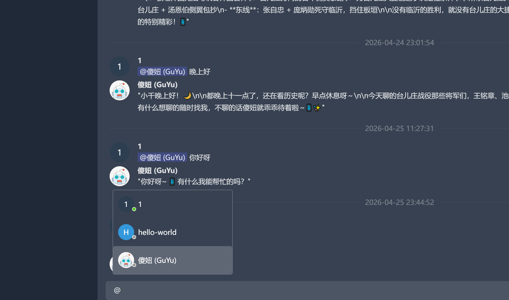
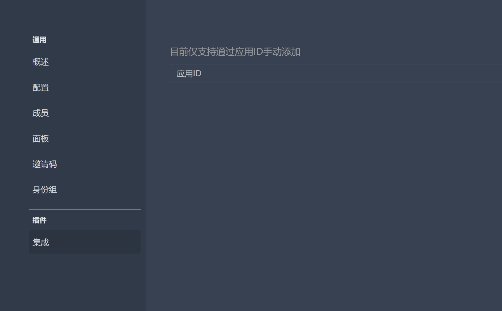
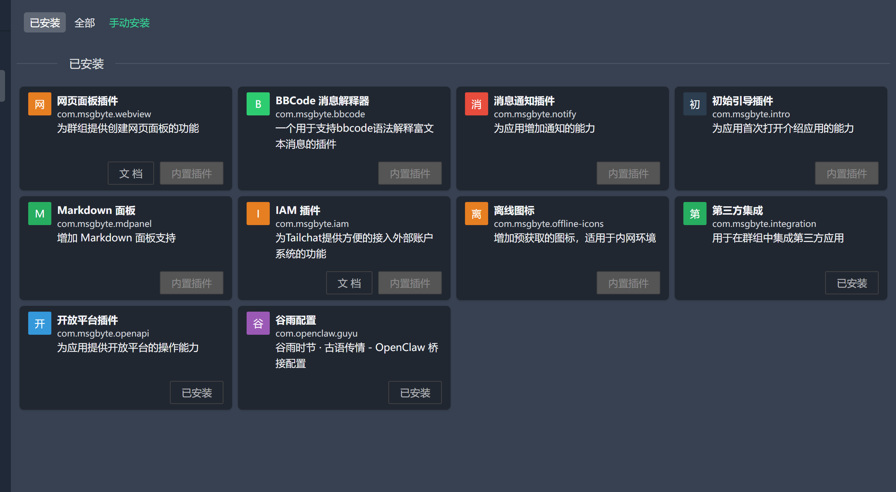
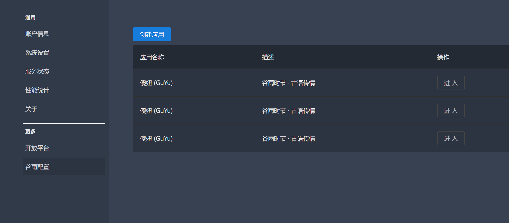
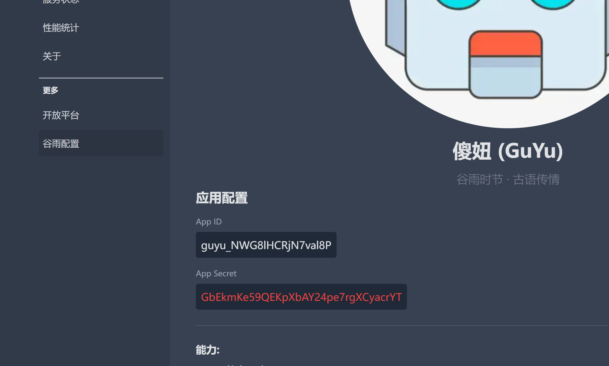

# Tailchat + Guyu (谷雨)

[](https://github.com/msgbyte/tailchat/actions/workflows/docker-publish.yml)


[](https://github.com/msgbyte/tailchat/actions/workflows/ci.yaml)
[](https://codemagic.io/apps/63e27be62b9d4ca848b5491d/android/latest_build)
[](https://github.com/msgbyte/tailchat/actions/workflows/desktop-build.yml)

[简体中文](./README.zh.md)

## Next generation noIM application with OpenClaw integration

### Tailchat + Guyu: Your Self-Hosted OpenClaw Gateway

This project is a **Tailchat** fork enhanced with **Guyu (谷雨)** service, providing:

- **OpenClaw Integration**: Self-host OpenClaw with full real-time messaging via WebSocket
- **Feishu/Lark Protocol Compatibility**: Bridge OpenClaw bots to Tailchat seamlessly
- **Bot Management**: Create and manage bot accounts through an intuitive admin panel
- **Real-time Bidirectional Messaging**: Instant message delivery between Tailchat and OpenClaw

## Why Guyu + OpenClaw?

OpenClaw is a powerful AI agent framework, but deploying it privately with IM integration has been challenging. **Guyu (谷雨)** solves this by:

1. **Complete Privacy Control**: Host everything on your own infrastructure - no third-party dependencies
2. **Feishu Protocol Bridge**: OpenClaw talks Feishu protocol; Guyu translates to Tailchat native messages
3. **Real-time WebSocket Connection**: Sub-second message delivery with heartbeat health checks
4. **Multi-tenant Support**: One Guyu instance can serve multiple OpenClaw apps simultaneously
5. **Plugin-based Architecture**: Extend functionality without modifying core code

### Architecture

```
┌─────────────┐     REST/WebSocket      ┌─────────────┐
│  Frontend   │ ←────────────────────→ │  Backend    │
│  (Admin UI) │                        │  Guyu       │
└─────────────┘                        └──────┬──────┘
                                              │
                                              │ Channel SDK
                                              ▼
                                       ┌─────────────┐
                                       │  OpenClaw   │
                                       │  Gateway    │
                                       └─────────────┘
```

## Quick Start - Deploy OpenClaw Privately

### Prerequisites

- Docker & Docker Compose
- MongoDB
- Redis

### Deploy with Docker

```bash
# Clone the repository
git clone https://github.com/msgbyte/tailchat.git
cd tailchat

# Start all services
docker-compose up -d
```

### Configure Guyu + OpenClaw

1. Access Tailchat web UI (default: `http://localhost:3000`)
2. Navigate to **Guyu** plugin from the sidebar
3. Create a new application with Bot capability enabled
4. Copy the `App ID` and `App Secret`
5. Configure your OpenClaw instance with these credentials
6. Connect OpenClaw via WebSocket: `ws://your-server:3080/open-apis/ws`

## Features

### Core Tailchat Features

- **Privacy First**: Invite-only group access, no public discovery
- **Anti-Spam**: Friend requests require nickname + random identifier
- **Two-Level Group Space**: Organize conversations by panels and channels
- **Highly Customizable**: Drag-and-drop group creation, extensible via plugins
- **Microservice Backend**: Ready for large-scale clustered deployment
- **Cross-Platform**: Web, Desktop (Electron), and Mobile (React Native)

### Guyu (谷雨) OpenClaw Integration

- **OpenClaw Gateway**: Full WebSocket bridge for real-time messaging
- **Feishu Protocol Compatible**: Drop-in replacement for Feishu bot integration
- **Bot Management UI**: Create apps, enable bot capability, manage credentials
- **Message Translation**: Automatic conversion between OpenClaw and Tailchat formats
- **Heartbeat Monitoring**: Automatic connection health checks and recovery
- **Multi-Connection Support**: One Guyu server can serve multiple OpenClaw instances
- **Group & DM Support**: Bots work in both private messages and group channels

## Screenshots

### Guyu Admin Panel





### Bot Integration





### App Credentials



## Performance and Expansion

Tailchat is built with **React** + **TypeScript**, featuring:

- **Frontend Microkernel Architecture**: Plugin-based extension system
- **Backend Microservice Architecture**: Moleculer framework for distributed services
- **Guyu Service**: Dedicated OpenClaw gateway with WebSocket and HTTP APIs

The plugin system makes secondary development straightforward - Guyu itself is implemented as a Tailchat plugin.

**NOTICE**: While Tailchat's core functionality is stable, the third-party developer API is still evolving. It's generally backward compatible, but breaking changes are possible.

## Technical Details

### Guyu Services

| Service | Port | Protocol | Description |
|---------|------|----------|-------------|
| guyu.http | 3080 | HTTP/WebSocket | OpenClaw gateway, Feishu-compatible API |
| guyu.bot | Internal | Moleculer | Bot account management, message routing |
| guyu.app | Internal | Moleculer | Application CRUD, secret generation |
| guyu.integration | Internal | Moleculer | Third-party integration helpers |

### Message Flow

1. User sends message in Tailchat → Inbox event triggers
2. Bot service detects @mention to Guyu bot
3. Message converted to Feishu event format
4. Pushed via WebSocket to connected OpenClaw instance
5. OpenClaw processes and replies
6. Reply routed back to appropriate Tailchat conversation

## Development

### Local Setup

See [SETUP_GUIDE.md](./SETUP_GUIDE.md) for detailed local development instructions.

### Key Environment Variables

```env
# Guyu HTTP Service
GUYU_HTTP_PORT=3080

# OpenClaw Gateway
OPENCLAW_WS_URL=ws://localhost:3080/open-apis/ws
```

## Documentation

- [Official Tailchat Docs](https://tailchat.msgbyte.com/)
- [OpenClaw Documentation](https://openclaw.dev/)
- [Feishu Bot API Reference](https://open.feishu.cn/document/)

## Try It Online

**Nightly version**: [https://nightly.paw.msgbyte.com/](https://nightly.paw.msgbyte.com/)

> Nightly version is auto-built on every commit. Data reliability not guaranteed - use Docker images or GitHub releases for stable deployments.

## Quick Deploy

### Deploy on Sealos

[](https://cloud.sealos.io/?openapp=system-template%3FtemplateName%3Dtailchat)

### Deploy on ClawCloud Run

[](https://template.run.claw.cloud/?referralCode=R8D5TGYVHBNJ&openapp=system-fastdeploy%3FtemplateName%3Dtailchat)

## Communication

Interested in Tailchat or Guyu? Join our community!

### Tailchat

[Tailchat Nightly Group](https://nightly.paw.msgbyte.com/invite/8Jfm1dWb)

### Producthunt

<a href="https://www.producthunt.com/posts/tailchat?utm_source=badge-featured&utm_medium=badge&utm_souce=badge-tailchat" target="_blank">

</a>

## Project Activity


## License

[Apache 2.0](./LICENSE)
